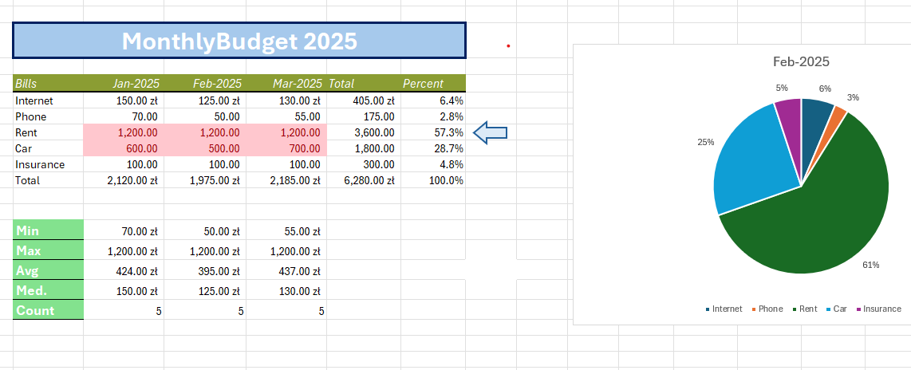

# Excel Monthly Budget Dashboard

## Overview
This project is an interactive personal finance dashboard built entirely in Microsoft Excel.

The goal of the project was to create a clean and visually structured monthly budget tracker using formulas, charts, and conditional formatting.

---

## Features

- Monthly expense tracking (Jan–Mar 2025)
- Automatic totals and percentage calculations
- Summary statistics (Min, Max, Average, Median, Count)
- Interactive pie chart visualization
- Clean dashboard layout with structured sections

---

## Tools Used

- Microsoft Excel
- Excel formulas (SUM, AVERAGE, MEDIAN, etc.)
- Conditional formatting
- Charts (Pie Chart)
- Layout and dashboard design principles

---

## Project Structure

project-files/
- Excel-Monthly-Budget-Dashboard.xlsx

images/
- dashboard-preview.png

---

## Preview

---

## How to Use

1. Download the Excel file from the repository.
2. Open in Microsoft Excel.
3. Modify monthly values to track your own expenses.
4. Charts and statistics update automatically.

---

## Learning Purpose

This project was created to practice:
- Excel dashboard design
- Data visualization
- Financial data organization
- Clean spreadsheet structuring
